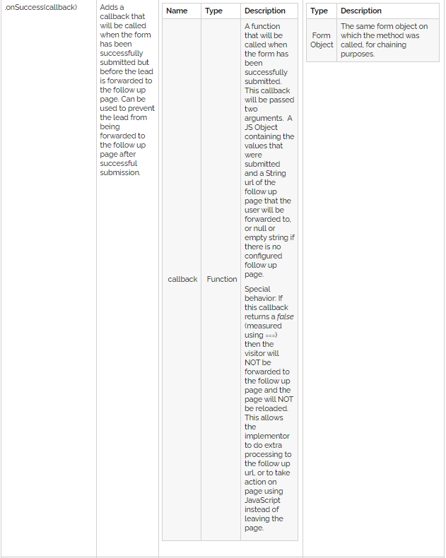

## Marketo Form Mirroring & Subsequent Error Notification

### Information sourced to aid decision making and inform choices

Source:
- https://developers.marketo.com/javascript-api/forms/api-reference/
Topic: 
- .OnSuccess(callback)
Visual Reference:

